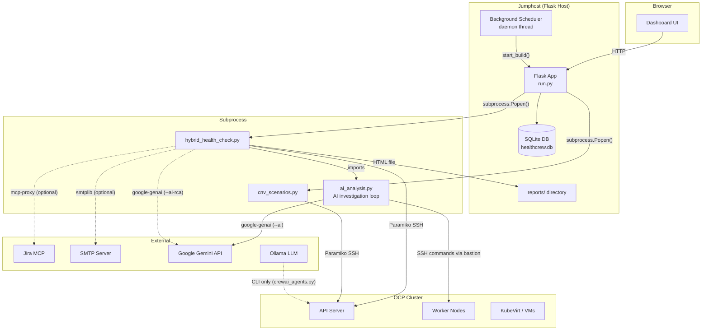
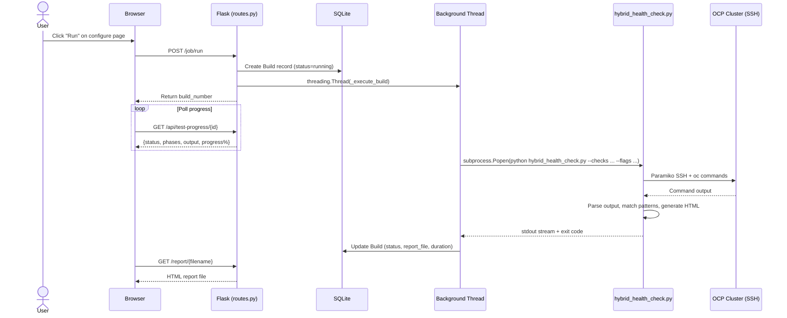
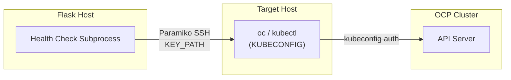
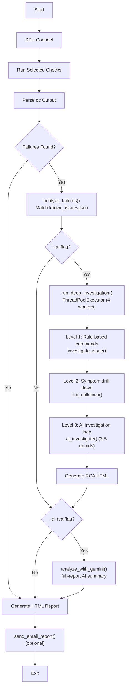
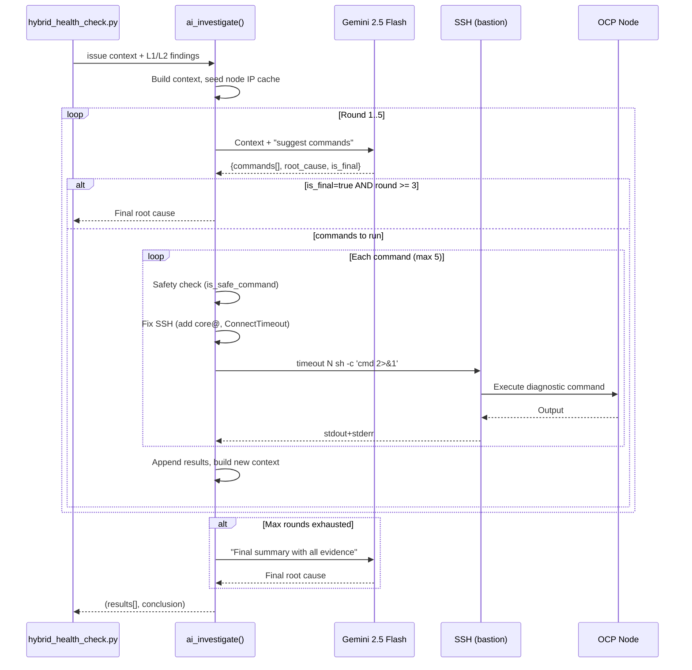
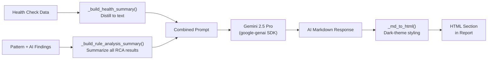
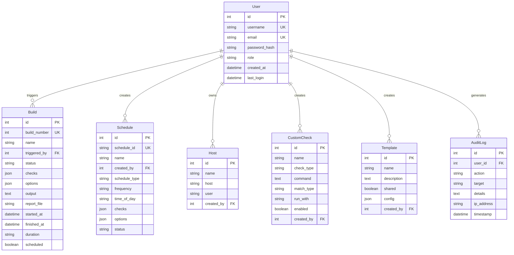
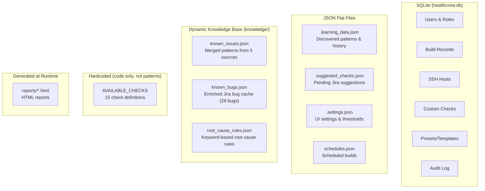
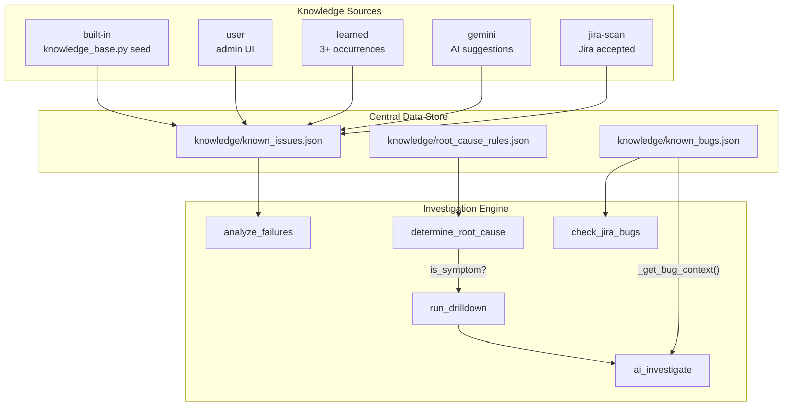

# Architecture

This document describes how the system works at a technical level. For user-facing setup and usage, see [README.md](../README.md). For feature descriptions and roadmap, see [DESIGN.md](DESIGN.md).

---

## System Overview



The system runs as a Flask web app on a jumphost that has SSH access to the OCP cluster. Health checks execute as **separate Python subprocesses** -- the Flask app spawns them, streams their stdout, and stores results in SQLite. This subprocess isolation means a crashing health check can't take down the web server.

---

## Build Execution Lifecycle

A "build" is a single health check run. This is the core flow from UI click to HTML report.



### Key details

- **Concurrency**: `MAX_CONCURRENT_BUILDS` (default 3). Excess builds are queued in memory and dequeued when a slot opens.
- **Phase tracking**: `_execute_build()` matches keywords in the subprocess stdout to advance phase indicators in the UI (e.g., "Connecting to host", "Running checks", "Generating report").
- **Task types**: Three execution paths share this lifecycle:
  - `health_check` -- runs `hybrid_health_check.py`
  - `cnv_scenarios` -- runs `cnv_scenarios.py` (kube-burner workloads)
  - `cnv_combined` -- runs scenarios first, then health check sequentially

---

## SSH Connection Model

All cluster interaction happens over SSH. The Flask host has an SSH key that grants access to a host with `oc` / `kubectl` configured.



### Connection flow

1. `get_ssh_client()` creates a global `paramiko.SSHClient` (one per subprocess, no connection pool).
2. `ssh_command(cmd)` prepends `export KUBECONFIG=/path/to/kubeconfig && ` to every command, then runs it via `exec_command()`.
3. The connection is reused for all checks within a single build run.
4. On connection failure, `SSHConnectionError` is raised with host, user, key path, and original error for debugging.

### Credentials

| Variable | Purpose |
|----------|---------|
| `RH_LAB_HOST` | SSH target hostname/IP |
| `RH_LAB_USER` | SSH username (default: `root`) |
| `SSH_KEY_PATH` | Path to private key |
| `KUBECONFIG_REMOTE` | Path to kubeconfig on the target host |

### Multiple SSH implementations

Four files implement SSH connections. Only `hybrid_health_check.py` is used by the dashboard:

| File | Used by | Notes |
|------|---------|-------|
| `healthchecks/hybrid_health_check.py` | Dashboard builds | Canonical. Global client, `ssh_command()` |
| `healthchecks/cnv_scenarios.py` | Dashboard (CNV scenarios) | Similar pattern, separate client |
| `healthchecks/simple_health_check.py` | CLI only | Minimal checks, standalone |
| `tools/ssh_tool.py` | CrewAI agents (CLI only) | CrewAI `BaseTool` wrapper |

---

## Health Check Engine

`healthchecks/hybrid_health_check.py` (~5200 lines) is the main engine. It runs as a subprocess and writes to stdout (streamed by the Flask thread) and generates an HTML report file. `healthchecks/ai_analysis.py` (~1100 lines) provides the AI investigation loop, Gemini API integration, SSH command safety/fixing, and the AI summary layer.

### Check registry

15 check types are defined in `config/settings.py` as `AVAILABLE_CHECKS`. Each entry specifies:
- `name`, `icon`, `description`, `category`
- `commands` -- list of `oc` commands and what they validate
- `default` -- whether enabled by default

Categories: Infrastructure, Workloads, Virtualization, Storage, Network, Resources, Security, Monitoring.

### Execution pipeline



### RCA pipeline

The RCA system has three investigation levels plus an optional AI summary layer. Each level digs deeper than the last, and the AI investigation loop (Level 3) is self-directed -- it decides what commands to run and when the root cause is specific enough.

#### Parallel execution

`run_deep_investigation()` groups all failures by their matched issue title (symptom type) and investigates **one representative per group** using a `ThreadPoolExecutor` with `max_workers=4`. If 19 failures map to 5 unique symptom types, only 5 investigations run (saving 14 duplicates). Results are applied to all similar issues in each group.

#### Level 1: Rule-based investigation

**Step 1 -- Failure collection.** `analyze_failures()` walks every subsystem in the collected health data and creates a typed failure object for each problem found. Supported failure types: `operator-degraded`, `operator-unavailable`, `node`, `alert`, `pod` (one per unhealthy pod), `virt-handler`, `virt-handler-memory`, `volumesnapshot`, `datavolume`, `migration-failed`, `stuck-migration`, `cordoned-vms`, `etcd`, `oom`, `csi`. Each failure carries `type`, `name`, `status`, `details`, and a `raw_output` string formatted like `oc` output.

**Step 2 -- Pattern matching.** Each failure is matched against `knowledge/known_issues.json` (loaded by `knowledge_base.py`). The algorithm:

1. Build a search string by concatenating `"{type} {name} {status} {details}"` and lowercasing it.
2. For each pattern entry in the knowledge base, count how many of its `pattern` keywords appear in the search string.
3. If at least one keyword matches, the entry is a candidate. Candidates are sorted by: most keyword matches first, then most Jira references (as a specificity tiebreaker).
4. The top candidate becomes `matched_issue`. All candidates are kept as `all_matches`.
5. If no pattern matches, the failure gets a generic "Unknown Issue" entry with fallback suggestions.
6. `update_last_matched()` timestamps the winning pattern in `known_issues.json` for usage tracking.

Pattern entries come from 5 sources: built-in (seeded on first run), user (added via admin UI), learned (auto-promoted from learning system at 3+ occurrences), gemini (AI-suggested after Gemini RCA), and jira-scan (accepted from Jira API scans).

**Step 3 -- Investigation commands.** `investigate_issue()` runs targeted `oc` commands via SSH to gather evidence. Each pattern entry in `known_issues.json` carries its own `investigation_commands` (baked in during seeding). `load_investigation_commands()` in `knowledge_base.py` indexes them by issue key and `inv_type`, plus includes built-in commands for generic issue types (pod-crashloop, pod-unknown) that are not knowledge-base entries.

**Step 4 -- Root cause determination.** `determine_root_cause()` loads rules from `knowledge/root_cause_rules.json` and evaluates them against the combined investigation output. Each rule specifies `issue_types`, `keywords_all` (AND), `keywords_any` (OR), `cause`, `confidence`, `explanation`. Rules with `is_symptom: true` trigger Level 2 drill-down.

#### Level 2: Symptom drill-down

When a root cause rule has `is_symptom: true` and a `drilldown` key, the system runs `run_drilldown()` with a deeper set of commands specific to the symptom. For example, "DiskPressure" triggers disk-specific commands (`df -h`, `du -sh`, kubelet logs). Drill-downs can chain: a drill-down conclusion can specify `follow_drilldown` for a second level. The drill-down produces a more specific conclusion than Level 1.

#### Level 3: AI-driven investigation loop

`ai_investigate()` in `healthchecks/ai_analysis.py` runs an iterative investigation loop where Gemini AI suggests diagnostic commands, the system executes them via SSH, and the AI analyzes the results to determine the root cause. This loop continues until the AI identifies the specific responsible component or `max_rounds` (default 5) is exhausted.



**Key design decisions:**

- **Self-evaluating AI.** The AI response includes `is_final` (boolean). The system only accepts `is_final=true` from round 3 onward (`min_rounds=3`), forcing at least 3 rounds of investigation. Early rounds include a hint: "You MUST suggest more commands - it is too early to claim is_final=true."
- **Component tracing.** The AI prompts emphasize identifying the specific responsible component, workload, pod, or namespace -- not just the symptom. "Disk full" is never accepted as final; the AI must trace to WHICH pods/images/logs filled the disk.
- **Enriched Jira context.** `_get_bug_context()` loads bug descriptions from `known_bugs.json` (29 bugs with summary, description_snippet, components, fix versions). These are injected into the investigation context as a `--- Related Known Jira Bugs ---` section, giving the AI real bug descriptions to compare against live symptoms. The final analysis prompt also instructs the AI to reference matching bugs.
- **Directory drill-down principle.** Finding a large directory always triggers deeper `du -sh <dir>/* | sort -rh` commands until the specific consumer is identified.
- **Node name-to-IP resolution.** `_node_ip_cache` maps OCP node hostnames to InternalIPs. Seeded from `oc get nodes -o wide` at the start of each investigation. `_fix_unbounded_commands()` auto-replaces hostnames with IPs and adds `core@` prefix for SSH to nodes.
- **SSH hardening.** Every SSH command gets `-o ConnectTimeout=8 -o StrictHostKeyChecking=no`. Commands are wrapped with `timeout N sh -c '...'` to prevent hanging. Stderr is merged with stdout (`2>&1`) so SSH errors are visible to the AI.
- **Read-only safety filter.** `is_safe_command()` blocks any command containing write/destructive keywords (delete, apply, patch, reboot, restart, rm, etc.).
- **Parallel investigation.** Multiple issue types are investigated concurrently via `ThreadPoolExecutor(max_workers=4)`. Each investigation runs its own AI loop independently.

**AI prompts:**

| Prompt | Purpose |
|--------|---------|
| `AI_INVESTIGATE_SYSTEM` | Round 1: initial investigation. Suggests diagnostic commands. Includes directory drill-down and owner-tracing guidance. |
| `AI_ANALYZE_SYSTEM` | Rounds 2+: analyzes command output, decides if root cause is specific enough or needs more digging. |

Both prompts return JSON: `{commands, root_cause, confidence, is_final, fix, needs_manual}`.

**Step 5 -- Jira integration** (optional). `check_jira_bugs()` attempts to query Jira via `mcp-proxy`. On failure, it falls back to `knowledge/known_bugs.json`. Compares bug fix versions against the cluster version to assess if a bug is fixed, open, or a regression.

#### AI summary layer (--ai-rca)

`analyze_with_gemini()` in `healthchecks/ai_analysis.py` provides a high-level LLM-powered analysis using Gemini 2.5 Pro. It always runs **after** the full investigation pipeline and receives all findings, so it focuses on cross-subsystem correlations and gaps rather than rediscovering known issues.



**Design decisions:**

- **Always runs after all investigation levels.** When `--ai-rca` is set, the full L1/L2/L3 pipeline runs first. The AI summary receives rule-based findings, drill-down results, AND AI investigation conclusions.
- **Graceful fallback.** If `GEMINI_API_KEY` is missing, the SDK is unavailable, or the API call fails, the pipeline continues without the AI section.
- **Markdown to HTML.** `_md_to_html()` is a line-by-line state machine that handles fenced code blocks, headers (h1-h5), bold, inline code, bullet/numbered lists (including nested), and horizontal rules. Styled for the existing dark-theme report.

**Environment variables:**

| Variable | Default | Purpose |
|----------|---------|---------|
| `GEMINI_API_KEY` or `GOOGLE_API_KEY` | (none) | Google Gemini API key |
| `GEMINI_MODEL` | `gemini-2.5-pro` | Model for AI summary layer |
| `GEMINI_INVESTIGATE_MODEL` | `gemini-2.5-pro` | Model for AI investigation loop (with chain-of-thought reasoning) |

---

## Data Model

SQLite database (`healthcrew.db`) managed by SQLAlchemy. Defined in `app/models.py`.



### All data stores

The system uses four types of storage: a SQLite database for structured application data, JSON flat files for runtime state, a dynamic knowledge base in the `knowledge/` directory (loaded by `healthchecks/knowledge_base.py`), and hardcoded Python definitions for check metadata.



#### SQLite database

| Table | What it stores | Managed by |
|-------|---------------|------------|
| `User` | Usernames, emails, password hashes, roles, last login | `app/auth.py` |
| `Build` | Build number, status, checks, options, output, report path, duration | `app/routes.py` |
| `Schedule` | Schedule config (DB model exists but scheduler reads JSON -- see below) | `app/models.py` |
| `Host` | SSH target hosts (name, host, user) | `app/routes.py` |
| `CustomCheck` | User-defined commands/scripts with match types | `app/routes.py` |
| `Template` | Saved check presets (shared or personal) | `app/routes.py` |
| `AuditLog` | Admin actions with timestamp, user, IP | `app/admin.py` |

#### JSON flat files

| File | What it stores | Read by | Written by |
|------|---------------|---------|------------|
| `.learning_data.json` | Discovered patterns, issue history, recurring issues (3+ occurrences), learned fixes, accepted suggested checks | `app/learning.py` | `app/learning.py` (after each build) |
| `.suggested_checks.json` | AI-suggested health checks from Jira scans, pending user review (accept/reject) | `app/routes.py` | `app/routes.py` (Jira scan) |
| `.settings.json` | UI settings: alert thresholds, Ollama model/URL, SSH defaults | `app/routes.py` | Settings page |
| `schedules.json` | Scheduled builds: type, frequency, time, checks, status | `app/scheduler.py` | Schedules page |

#### Dynamic knowledge base

All pattern and investigation data lives in JSON files in the `knowledge/` directory, loaded dynamically by `healthchecks/knowledge_base.py`. On first run, `known_issues.json` is seeded from `_BUILTIN_SEED` in `knowledge_base.py` (18 patterns with investigation commands baked in). After seeding, all pattern data lives exclusively in JSON - there are no hardcoded pattern dicts in the engine code.

| File | What it contains | Managed by |
|------|------------------|-------------|
| `knowledge/known_issues.json` | Merged patterns from 5 sources (built-in, user, learned, gemini, jira-scan). Each pattern has `pattern`, `jira`, `description`, `root_cause`, `suggestions`, plus `source`, `confidence`, `created`, `last_matched`, `investigation_commands`. | `healthchecks/knowledge_base.py` |
| `knowledge/known_bugs.json` | Growing Jira bug cache: status, resolution, fix versions, affected versions. Fallback when Jira MCP is unreachable. | `healthchecks/knowledge_base.py` |
| `knowledge/root_cause_rules.json` | Rules for `determine_root_cause()`. Each rule has `issue_types`, `keywords_all`, `keywords_any`, `cause`, `confidence`, `explanation`, optional `is_symptom` and `drilldown`. Rules with `is_symptom: true` trigger Level 2 drill-down. | `healthchecks/knowledge_base.py`, admin UI |

`AVAILABLE_CHECKS` remains in `config/settings.py` (15 check definitions: name, icon, description, category, `oc` commands). Drives both the UI and the check runner.

#### Dynamic Knowledge Store

The knowledge base is loaded and merged by `healthchecks/knowledge_base.py`. Key files:

- **`knowledge/known_issues.json`** - Merged patterns from 5 sources: built-in (seeded from `_BUILTIN_SEED` in `knowledge_base.py`), user (admin UI), learned (3+ occurrences auto-promoted from learning system), gemini (AI-suggested after analysis), jira-scan (accepted Jira suggestions). Each pattern carries its own `investigation_commands`.
- **`knowledge/known_bugs.json`** - Enriched Jira bug cache with 29 bugs. Each entry stores `summary`, `description_snippet` (300-char problem description), `components` (Jira component names), plus status, resolution, fix versions, affected versions. Bug descriptions are injected into the AI investigation context via `_get_bug_context()` so the AI can compare live symptoms against known bug patterns. Refreshable via admin UI (pulls rich fields from Jira REST API).
- **`knowledge/root_cause_rules.json`** - Keyword-based rules for `determine_root_cause()`. Rules with `is_symptom: true` trigger the Level 2 drill-down pipeline. Ships with 35+ built-in rules.
- **`healthchecks/knowledge_base.py`** - Load/save/merge logic: `load_known_issues()`, `load_known_bugs()`, `load_investigation_commands()`, `save_known_issue()`, `save_known_bug()`, `update_last_matched()`. Also contains `_BUILTIN_SEED` (18 patterns with investigation commands) used for first-run seeding.

Each pattern has fields: `source`, `confidence`, `created`, `last_matched`, `investigation_commands`. On first run, `known_issues.json` is seeded from `_BUILTIN_SEED` in `knowledge_base.py`. After that, all data lives exclusively in JSON.

Five knowledge sources:

| Source | Description |
|--------|-------------|
| built-in | Shipped with code, seeded on first run |
| user | Added via admin UI (`admin_knowledge.html`) |
| learned | Auto-promoted from learning system after 3+ occurrences |
| gemini | AI-suggested patterns accepted after analysis |
| jira-scan | Accepted suggestions from Jira scan |



#### How they connect

```
User clicks "Run" in Dashboard
    │
    ├─ Build record created ──────────────→ SQLite (Build table)
    ├─ Check config loaded ───────────────→ AVAILABLE_CHECKS (config/settings.py)
    ├─ Thresholds loaded ─────────────────→ .settings.json
    │
    ├─ SSH + oc commands ─────────────────→ Live cluster data
    │
    ├─ L1: Pattern matching ──────────────→ knowledge/known_issues.json
    ├─ L1: Root cause rules ──────────────→ knowledge/root_cause_rules.json
    ├─ L2: Symptom drill-down ────────────→ Deeper SSH commands (when is_symptom=true)
    ├─ L3: AI investigation loop ─────────→ Gemini 2.5 Flash (iterative SSH commands)
    ├─    (parallel per issue type) ──────→ ThreadPoolExecutor (4 workers)
    ├─    (enriched Jira context) ────────→ known_bugs.json (29 bugs with descriptions fed to AI)
    ├─ Jira bug matching ─────────────────→ knowledge/known_bugs.json (fallback when MCP unreachable)
    ├─ AI summary (--ai-rca) ─────────────→ Gemini 2.5 Pro (correlation analysis)
    │
    ├─ Pattern learning ──────────────────→ .learning_data.json (updated)
    ├─ HTML report saved ─────────────────→ reports/ directory
    └─ Build record updated ──────────────→ SQLite (Build table)
```

### Storage inconsistency (known)

The scheduler has a `Schedule` DB model but still reads from `schedules.json` at runtime. Both must be considered the source of truth until the migration is complete.

---

## Background Scheduler

`app/scheduler.py` runs a daemon thread that wakes every 60 seconds, reads `schedules.json`, and triggers builds for any schedule whose time has come.

- **Schedule types**: `once` (one-shot, marks `completed` after run), `recurring`
- **Frequencies**: `hourly`, `daily`, `weekly` (with day selection), `monthly` (with day-of-month), `custom` (cron-like)
- **Execution**: Calls `start_build()` from `app/routes.py` with `user_id=None` (system-triggered)
- **Dedup**: Skips a schedule if `last_run` was within the check interval
- **Start condition**: Only starts in the main Werkzeug process (`WERKZEUG_RUN_MAIN=true`) or when not in debug mode, to avoid duplicate schedulers from the reloader

---

## Authentication and Authorization

Session-based auth via Flask-Login. Passwords hashed with bcrypt.

| Role | Permissions |
|------|------------|
| `admin` | Everything: user management, builds, schedules, settings, audit log |
| `operator` | Run builds, create schedules, manage own templates and hosts |
| `viewer` | Read-only: view dashboard, builds, reports |

- First registered user is auto-promoted to `admin`
- `OPEN_REGISTRATION` (default `true`) controls whether new users can self-register
- Decorators: `@login_required`, `@admin_required`, `@operator_required`

---

## Configuration Hierarchy

Five configuration sources, listed by precedence (highest to lowest):

| Priority | Source | What it controls | Set by |
|----------|--------|-----------------|--------|
| 1 | CLI flags on `hybrid_health_check.py` | Per-run overrides: checks, RCA level, email, server | Subprocess args from Flask |
| 2 | `.settings.json` | Runtime UI settings: AI model/URL, thresholds | Settings page |
| 3 | Environment variables | SSH, Flask, database, email | `.env` or `~/.config/cnv-healthcrew/config.env` |
| 4 | `config/settings.py` (`Config` class) | Defaults for all settings | Code |
| 5 | `schedules.json` | Scheduler state | Schedules UI |

### Environment loading

`config/settings.py` checks for `~/.config/cnv-healthcrew/config.env` first (installed mode). If not found, falls back to `.env` in the project root (dev mode). Installed mode also uses XDG directories (`~/.local/share/cnv-healthcrew/`) for data, reports, and the database.

---

## AI Integration Status

| Component | Status | Details |
|-----------|--------|---------|
| AI investigation loop | **Functional** | `ai_investigate()` in `ai_analysis.py` -- Gemini 2.5 Flash runs iterative diagnostic commands (3-5 rounds). Activated with `--ai` flag. |
| Gemini AI summary | **Functional** | `analyze_with_gemini()` in `ai_analysis.py` -- Gemini 2.5 Pro high-level correlation analysis. Activated with `--ai-rca` flag. |
| RCA engine (rule-based) | Fully functional | 3-level pipeline: pattern matching, symptom drill-down, AI investigation. Parallel execution via ThreadPoolExecutor. |
| Node SSH automation | Functional | Auto-resolves node hostnames to InternalIPs, adds `core@` prefix, ConnectTimeout, stderr capture. |
| CrewAI multi-agent health check | CLI only | `healthchecks/crewai_agents.py` -- not integrated into dashboard |
| Ollama (local LLM) | Config stored, not wired | Settings UI saves model/URL but `hybrid_health_check.py` does not use them |
| Jira integration | Functional with fallback | Tries MCP, falls back to `knowledge/known_bugs.json`. Enriched cache (29 bugs with summary, description, components) fed to AI during investigation via `_get_bug_context()`. |
| Email search | Stub | `search_emails_for_issues()` builds keywords but calls nothing |

---

## Project Structure

```
ocp-health-crew/
├── run.py                         # Entry point: creates Flask app and starts server
├── config/
│   ├── settings.py                # Config class, AVAILABLE_CHECKS registry
│   └── cnv_scenarios.py           # CNV scenario definitions (kube-burner)
├── app/
│   ├── __init__.py                # App factory: create_app(), blueprint registration
│   ├── models.py                  # SQLAlchemy models (User, Build, Schedule, ...)
│   ├── routes.py                  # Dashboard blueprint: UI routes, build execution
│   ├── auth.py                    # Auth blueprint: login, register, profile
│   ├── admin.py                   # Admin blueprint: user CRUD, audit log
│   ├── scheduler.py               # Background scheduler (daemon thread + schedules.json)
│   ├── learning.py                # Pattern recognition from historical runs
│   ├── checks/                    # Re-exports AVAILABLE_CHECKS
│   ├── integrations/              # Stubs for future SSH, Jira, email integrations
│   ├── templates/                 # Jinja2 HTML templates
│   │   └── admin_knowledge.html   # Admin UI for knowledge base management
│   └── static/                    # CSS, images
├── healthchecks/
│   ├── hybrid_health_check.py     # Main engine: SSH checks, 3-level RCA, HTML reports
│   ├── knowledge_base.py          # Dynamic knowledge: load/save/merge, built-in seed data
│   ├── ai_analysis.py             # AI investigation loop, Gemini API, SSH safety, AI summary
│   ├── cnv_scenarios.py           # kube-burner scenario runner
│   ├── cnv_report.py              # CNV scenario HTML report generator
│   ├── simple_health_check.py     # Minimal CLI health check
│   └── crewai_agents.py           # CrewAI agents (standalone, CLI only)
├── knowledge/
│   ├── known_issues.json          # Merged patterns from 5 sources
│   ├── known_bugs.json            # Enriched Jira bug cache (29 bugs with descriptions)
│   └── root_cause_rules.json      # Root cause determination rules (keyword matching)
├── tools/
│   └── ssh_tool.py                # CrewAI BaseTool for SSH commands
├── scripts/
│   ├── install.sh                 # One-line installer
│   ├── uninstall.sh               # Uninstaller
│   ├── start_dashboard.sh         # Start script with browser open
│   └── migrate_json_to_db.py      # Legacy JSON to SQLite migration
├── docs/
│   ├── ARCHITECTURE.md            # This file
│   └── DESIGN.md                  # Feature descriptions and roadmap
├── reports/                       # Generated HTML reports (gitignored)
└── legacy/
    └── web_dashboard.py           # Old standalone Flask app (deprecated)
```
