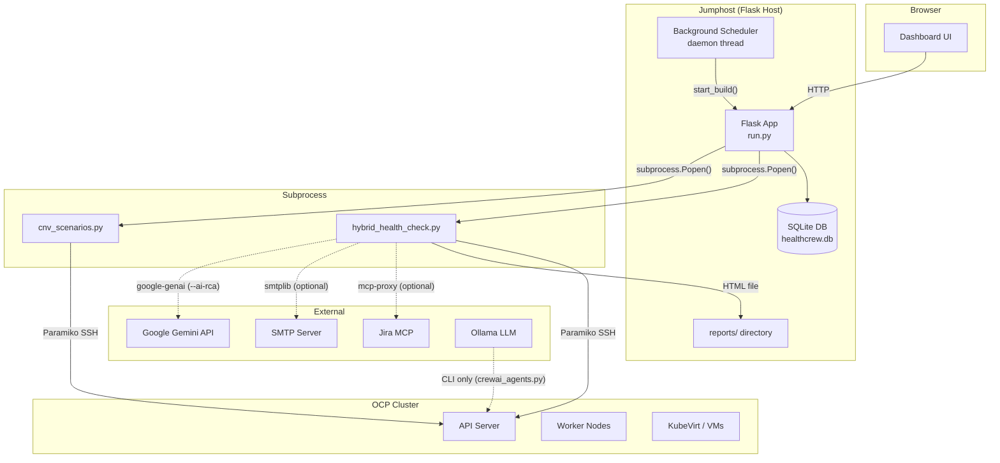
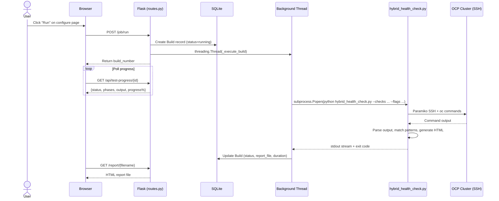
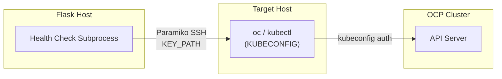
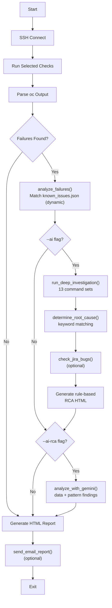
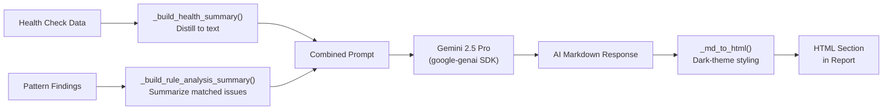
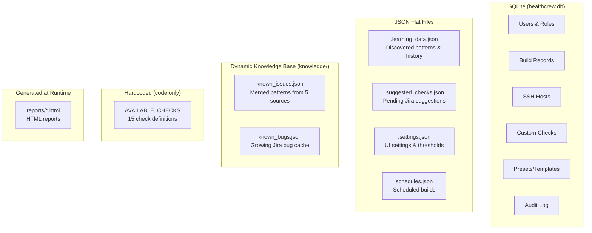
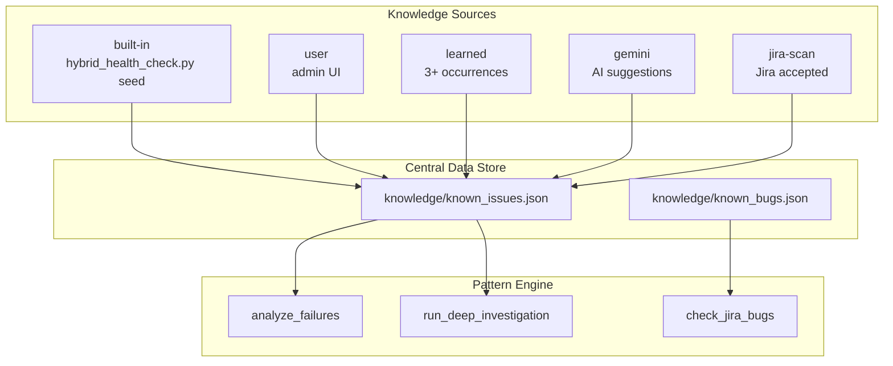

# Architecture

This document describes how the system works at a technical level. For user-facing setup and usage, see [README.md](../README.md). For feature descriptions and roadmap, see [DESIGN.md](DESIGN.md).

---

## System Overview



The system runs as a Flask web app on a jumphost that has SSH access to the OCP cluster. Health checks execute as **separate Python subprocesses** -- the Flask app spawns them, streams their stdout, and stores results in SQLite. This subprocess isolation means a crashing health check can't take down the web server.

---

## Build Execution Lifecycle

A "build" is a single health check run. This is the core flow from UI click to HTML report.



### Key details

- **Concurrency**: `MAX_CONCURRENT_BUILDS` (default 3). Excess builds are queued in memory and dequeued when a slot opens.
- **Phase tracking**: `_execute_build()` matches keywords in the subprocess stdout to advance phase indicators in the UI (e.g., "Connecting to host", "Running checks", "Generating report").
- **Task types**: Three execution paths share this lifecycle:
  - `health_check` -- runs `hybrid_health_check.py`
  - `cnv_scenarios` -- runs `cnv_scenarios.py` (kube-burner workloads)
  - `cnv_combined` -- runs scenarios first, then health check sequentially

---

## SSH Connection Model

All cluster interaction happens over SSH. The Flask host has an SSH key that grants access to a host with `oc` / `kubectl` configured.



### Connection flow

1. `get_ssh_client()` creates a global `paramiko.SSHClient` (one per subprocess, no connection pool).
2. `ssh_command(cmd)` prepends `export KUBECONFIG=/path/to/kubeconfig && ` to every command, then runs it via `exec_command()`.
3. The connection is reused for all checks within a single build run.
4. On connection failure, `SSHConnectionError` is raised with host, user, key path, and original error for debugging.

### Credentials

| Variable | Purpose |
|----------|---------|
| `RH_LAB_HOST` | SSH target hostname/IP |
| `RH_LAB_USER` | SSH username (default: `root`) |
| `SSH_KEY_PATH` | Path to private key |
| `KUBECONFIG_REMOTE` | Path to kubeconfig on the target host |

### Multiple SSH implementations

Four files implement SSH connections. Only `hybrid_health_check.py` is used by the dashboard:

| File | Used by | Notes |
|------|---------|-------|
| `healthchecks/hybrid_health_check.py` | Dashboard builds | Canonical. Global client, `ssh_command()` |
| `healthchecks/cnv_scenarios.py` | Dashboard (CNV scenarios) | Similar pattern, separate client |
| `healthchecks/simple_health_check.py` | CLI only | Minimal checks, standalone |
| `tools/ssh_tool.py` | CrewAI agents (CLI only) | CrewAI `BaseTool` wrapper |

---

## Health Check Engine

`healthchecks/hybrid_health_check.py` (~4300 lines) is the main engine. It runs as a subprocess and writes to stdout (streamed by the Flask thread) and generates an HTML report file.

### Check registry

15 check types are defined in `config/settings.py` as `AVAILABLE_CHECKS`. Each entry specifies:
- `name`, `icon`, `description`, `category`
- `commands` -- list of `oc` commands and what they validate
- `default` -- whether enabled by default

Categories: Infrastructure, Workloads, Virtualization, Storage, Network, Resources, Security, Monitoring.

### Execution pipeline



### RCA pipeline

The RCA system has two layers: a deterministic rule-based engine and an optional AI-powered analysis.

#### Layer 1: Rule-based RCA (--ai or --rca-bugs)

1. **Pattern matching** -- Each failure is compared against `knowledge/known_issues.json`, loaded by `knowledge_base.py`. Patterns come from 5 sources (built-in, user, learned, gemini, jira-scan). Each entry has keyword patterns, Jira bug references, root cause descriptions, and remediation suggestions.

2. **Investigation** -- When an issue matches, `investigation_commands` (embedded in each pattern or loaded via `load_investigation_commands()`) provides targeted `oc` commands to gather evidence (e.g., pod logs, node conditions, resource usage). Command sets cover: pod-crashloop, pod-unknown, virt-handler-memory, volumesnapshot, noobaa, metal3, etcd, migration, csi, oom, operator-degraded, operator-unavailable, node, alert.

3. **Root cause determination** -- `determine_root_cause()` scans investigation output for keywords (e.g., `oomkilled`, `crashloopbackoff`, `image pull`, `disk pressure`) and returns the highest-confidence match.

4. **Jira integration** (optional) -- `check_jira_bugs()` attempts to query Jira via `mcp-proxy`. On failure, it falls back to `knowledge/known_bugs.json`. Compares bug fix versions against the cluster version to assess if a bug is fixed, open, or a regression.

#### Layer 2: Gemini AI RCA (--ai-rca)

`healthchecks/ai_analysis.py` provides LLM-powered root cause analysis using Google Gemini. It always runs **after** the pattern matching phase and receives the rule-based findings, so Gemini focuses on correlations and gaps rather than rediscovering known issues.



**Design decisions:**

- **Always runs after pattern matching.** When `--ai-rca` is set, `analyze_failures()` runs automatically (even without `--ai`). The pattern engine is fast and free -- its findings give Gemini a head start. With `--ai --ai-rca`, the deep investigation results are also included.
- **Two-input prompt.** `_build_health_summary()` distills the raw cluster data. `_build_rule_analysis_summary()` distills the pattern findings (matched issue titles, Jira refs, root causes, investigation results). Both are sent in the same prompt, with instructions to confirm/challenge the rule findings and fill gaps.
- **Graceful fallback.** If `GEMINI_API_KEY` is missing, the SDK is unavailable, or the API call fails, the pipeline continues without the AI section. The health check never breaks due to an AI failure.
- **Token budget.** Temperature 0.3, max 4096 output tokens. Input is summarized to keep costs low (~$0.003 per run).
- **Markdown to HTML.** `_md_to_html()` is a line-by-line state machine that handles fenced code blocks, headers (h1-h5), bold, inline code, bullet/numbered lists (including nested), and horizontal rules. Styled for the existing dark-theme report.

**Environment variables:**

| Variable | Default | Purpose |
|----------|---------|---------|
| `GEMINI_API_KEY` | (none) | Google Gemini API key |
| `GEMINI_MODEL` | `gemini-2.5-pro` | Model to use for analysis |

---

## Data Model

SQLite database (`healthcrew.db`) managed by SQLAlchemy. Defined in `app/models.py`.


### All data stores

The system uses four types of storage: a SQLite database for structured application data, JSON flat files for runtime state, a dynamic knowledge base in the `knowledge/` directory (loaded by `healthchecks/knowledge_base.py`), and hardcoded Python definitions for check metadata.



#### SQLite database

| Table | What it stores | Managed by |
|-------|---------------|------------|
| `User` | Usernames, emails, password hashes, roles, last login | `app/auth.py` |
| `Build` | Build number, status, checks, options, output, report path, duration | `app/routes.py` |
| `Schedule` | Schedule config (DB model exists but scheduler reads JSON -- see below) | `app/models.py` |
| `Host` | SSH target hosts (name, host, user) | `app/routes.py` |
| `CustomCheck` | User-defined commands/scripts with match types | `app/routes.py` |
| `Template` | Saved check presets (shared or personal) | `app/routes.py` |
| `AuditLog` | Admin actions with timestamp, user, IP | `app/admin.py` |

#### JSON flat files

| File | What it stores | Read by | Written by |
|------|---------------|---------|------------|
| `.learning_data.json` | Discovered patterns, issue history, recurring issues (3+ occurrences), learned fixes, accepted suggested checks | `app/learning.py` | `app/learning.py` (after each build) |
| `.suggested_checks.json` | AI-suggested health checks from Jira scans, pending user review (accept/reject) | `app/routes.py` | `app/routes.py` (Jira scan) |
| `.settings.json` | UI settings: alert thresholds, Ollama model/URL, SSH defaults | `app/routes.py` | Settings page |
| `schedules.json` | Scheduled builds: type, frequency, time, checks, status | `app/scheduler.py` | Schedules page |

#### Dynamic knowledge base

`KNOWN_ISSUES`, `INVESTIGATION_COMMANDS`, and `KNOWN_BUGS` are now externalized to JSON files in the `knowledge/` directory and loaded dynamically by `healthchecks/knowledge_base.py`. The system seeds from hardcoded dicts in `hybrid_health_check.py` on first run for backward compatibility.

| File | What it contains | Managed by |
|------|------------------|-------------|
| `knowledge/known_issues.json` | Merged patterns from 5 sources (built-in, user, learned, gemini, jira-scan). Each pattern has `pattern`, `jira`, `description`, `root_cause`, `suggestions`, plus `source`, `confidence`, `created`, `last_matched`, `investigation_commands`. | `healthchecks/knowledge_base.py` |
| `knowledge/known_bugs.json` | Growing Jira bug cache: status, resolution, fix versions, affected versions. Fallback when Jira MCP is unreachable. | `healthchecks/knowledge_base.py` |

`AVAILABLE_CHECKS` remains in `config/settings.py` (15 check definitions: name, icon, description, category, `oc` commands). Drives both the UI and the check runner.

#### Dynamic Knowledge Store

The knowledge base is loaded and merged by `healthchecks/knowledge_base.py`. Key files:

- **`knowledge/known_issues.json`** - Merged patterns from 5 sources: built-in (shipped with code), user (admin UI), learned (3+ occurrences auto-promoted from learning system), gemini (AI-suggested after analysis), jira-scan (accepted Jira suggestions).
- **`knowledge/known_bugs.json`** - Growing Jira bug cache, seeded from hardcoded dicts and extended when Jira MCP returns new bugs.
- **`healthchecks/knowledge_base.py`** - Load/save/merge logic: `load_known_issues()`, `load_known_bugs()`, `load_investigation_commands()`, `save_known_issue()`, `save_known_bug()`, `update_last_matched()`.

Each pattern has fields: `source`, `confidence`, `created`, `last_matched`, `investigation_commands`. The system seeds from hardcoded dicts in `hybrid_health_check.py` on first run for backward compatibility.

Five knowledge sources:

| Source | Description |
|--------|-------------|
| built-in | Shipped with code, seeded on first run |
| user | Added via admin UI (`admin_knowledge.html`) |
| learned | Auto-promoted from learning system after 3+ occurrences |
| gemini | AI-suggested patterns accepted after analysis |
| jira-scan | Accepted suggestions from Jira scan |



#### How they connect

```
User clicks "Run" in Dashboard
    │
    ├─ Build record created ──────────────→ SQLite (Build table)
    ├─ Check config loaded ───────────────→ AVAILABLE_CHECKS (config/settings.py)
    ├─ Thresholds loaded ─────────────────→ .settings.json
    │
    ├─ SSH + oc commands ─────────────────→ Live cluster data
    │
    ├─ Pattern matching ──────────────────→ knowledge/known_issues.json (via knowledge_base.py)
    ├─ Deep investigation (--ai) ─────────→ investigation_commands from known_issues.json
    ├─ Jira bug matching ─────────────────→ knowledge/known_bugs.json (fallback when MCP unreachable)
    ├─ Gemini AI analysis (--ai-rca) ─────→ Gemini API (external)
    │
    ├─ Pattern learning ──────────────────→ .learning_data.json (updated)
    ├─ HTML report saved ─────────────────→ reports/ directory
    └─ Build record updated ──────────────→ SQLite (Build table)
```

### Storage inconsistency (known)

The scheduler has a `Schedule` DB model but still reads from `schedules.json` at runtime. Both must be considered the source of truth until the migration is complete.

---

## Background Scheduler

`app/scheduler.py` runs a daemon thread that wakes every 60 seconds, reads `schedules.json`, and triggers builds for any schedule whose time has come.

- **Schedule types**: `once` (one-shot, marks `completed` after run), `recurring`
- **Frequencies**: `hourly`, `daily`, `weekly` (with day selection), `monthly` (with day-of-month), `custom` (cron-like)
- **Execution**: Calls `start_build()` from `app/routes.py` with `user_id=None` (system-triggered)
- **Dedup**: Skips a schedule if `last_run` was within the check interval
- **Start condition**: Only starts in the main Werkzeug process (`WERKZEUG_RUN_MAIN=true`) or when not in debug mode, to avoid duplicate schedulers from the reloader

---

## Authentication and Authorization

Session-based auth via Flask-Login. Passwords hashed with bcrypt.

| Role | Permissions |
|------|------------|
| `admin` | Everything: user management, builds, schedules, settings, audit log |
| `operator` | Run builds, create schedules, manage own templates and hosts |
| `viewer` | Read-only: view dashboard, builds, reports |

- First registered user is auto-promoted to `admin`
- `OPEN_REGISTRATION` (default `true`) controls whether new users can self-register
- Decorators: `@login_required`, `@admin_required`, `@operator_required`

---

## Configuration Hierarchy

Five configuration sources, listed by precedence (highest to lowest):

| Priority | Source | What it controls | Set by |
|----------|--------|-----------------|--------|
| 1 | CLI flags on `hybrid_health_check.py` | Per-run overrides: checks, RCA level, email, server | Subprocess args from Flask |
| 2 | `.settings.json` | Runtime UI settings: AI model/URL, thresholds | Settings page |
| 3 | Environment variables | SSH, Flask, database, email | `.env` or `~/.config/cnv-healthcrew/config.env` |
| 4 | `config/settings.py` (`Config` class) | Defaults for all settings | Code |
| 5 | `schedules.json` | Scheduler state | Schedules UI |

### Environment loading

`config/settings.py` checks for `~/.config/cnv-healthcrew/config.env` first (installed mode). If not found, falls back to `.env` in the project root (dev mode). Installed mode also uses XDG directories (`~/.local/share/cnv-healthcrew/`) for data, reports, and the database.

---

## AI Integration Status

| Component | Status | Details |
|-----------|--------|---------|
| Gemini AI RCA | **Functional** | `healthchecks/ai_analysis.py` -- calls Gemini 2.5 Pro via `google-genai` SDK. Activated with `--ai-rca` flag. |
| CrewAI multi-agent health check | CLI only | `healthchecks/crewai_agents.py` -- not integrated into dashboard |
| Ollama (local LLM) | Config stored, not wired | Settings UI saves model/URL but `hybrid_health_check.py` does not use them |
| RCA engine (rule-based) | Fully functional | Pattern matching against dynamic known_issues.json, investigation commands per pattern |
| Jira integration | Functional with fallback | Tries MCP, falls back to `knowledge/known_bugs.json` |
| Email search | Stub | `search_emails_for_issues()` builds keywords but calls nothing |

---

## Project Structure

```
ocp-health-crew/
├── run.py                         # Entry point: creates Flask app and starts server
├── config/
│   ├── settings.py                # Config class, AVAILABLE_CHECKS registry
│   └── cnv_scenarios.py           # CNV scenario definitions (kube-burner)
├── app/
│   ├── __init__.py                # App factory: create_app(), blueprint registration
│   ├── models.py                  # SQLAlchemy models (User, Build, Schedule, ...)
│   ├── routes.py                  # Dashboard blueprint: UI routes, build execution
│   ├── auth.py                    # Auth blueprint: login, register, profile
│   ├── admin.py                   # Admin blueprint: user CRUD, audit log
│   ├── scheduler.py               # Background scheduler (daemon thread + schedules.json)
│   ├── learning.py                # Pattern recognition from historical runs
│   ├── checks/                    # Re-exports AVAILABLE_CHECKS
│   ├── integrations/              # Stubs for future SSH, Jira, email integrations
│   ├── templates/                 # Jinja2 HTML templates
│   │   └── admin_knowledge.html   # Admin UI for knowledge base management
│   └── static/                    # CSS, images
├── healthchecks/
│   ├── hybrid_health_check.py     # Main engine: SSH checks, RCA, HTML reports
│   ├── knowledge_base.py          # Dynamic knowledge: load/save/merge known_issues, known_bugs
│   ├── ai_analysis.py             # Gemini AI RCA: API call, prompt, markdown-to-HTML
│   ├── cnv_scenarios.py           # kube-burner scenario runner
│   ├── cnv_report.py              # CNV scenario HTML report generator
│   ├── simple_health_check.py     # Minimal CLI health check
│   └── crewai_agents.py           # CrewAI agents (standalone, CLI only)
├── knowledge/
│   ├── known_issues.json          # Merged patterns from 5 sources
│   └── known_bugs.json            # Jira bug cache
├── tools/
│   └── ssh_tool.py                # CrewAI BaseTool for SSH commands
├── scripts/
│   ├── install.sh                 # One-line installer
│   ├── uninstall.sh               # Uninstaller
│   ├── start_dashboard.sh         # Start script with browser open
│   └── migrate_json_to_db.py      # Legacy JSON to SQLite migration
├── docs/
│   ├── ARCHITECTURE.md            # This file
│   └── DESIGN.md                  # Feature descriptions and roadmap
├── reports/                       # Generated HTML reports (gitignored)
└── legacy/
    └── web_dashboard.py           # Old standalone Flask app (deprecated)
```
